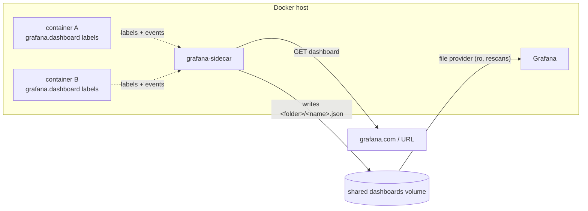

# grafana-sidecar

**Grafana dashboards, declared right on your Docker containers.**

[](https://github.com/davidborzek/grafana-sidecar/actions/workflows/ci.yaml)
[](LICENSE)
[](https://github.com/davidborzek/grafana-sidecar/releases)

grafana-sidecar watches the Docker API and turns a container label into a
provisioned Grafana dashboard. A service declares the dashboard it wants — a
[grafana.com](https://grafana.com/grafana/dashboards/) id or a URL — right next
to itself, in the same compose file, and grafana-sidecar downloads it into the
directory Grafana provisions from. Think of it as the Docker-label equivalent of
the Grafana Helm chart's dashboard sidecar (which watches labelled ConfigMaps).

> [!WARNING]
> **Early-stage software.** grafana-sidecar is pre-1.0 — expect rough edges and
> occasional breaking changes to labels or configuration before 1.0. It
> provisions **remote** dashboards (grafana.com id or URL) only.

```yaml
services:
  node-exporter:
    image: quay.io/prometheus/node-exporter
    labels:
      grafana.dashboard.gnetId: "1860"
      grafana.dashboard.revision: "45"
      grafana.dashboard.datasource: Prometheus
      grafana.dashboard.folder: System
```

That's it. grafana-sidecar downloads dashboard 1860 into `System/node-exporter.json`,
Grafana provisions it, done. Remove the container and the dashboard goes with it.

## How it works



1. grafana-sidecar lists containers (running or stopped) and subscribes to Docker events.
2. For every container carrying `grafana.dashboard.*` labels it downloads each
   declared dashboard (a grafana.com `gnetId`+`revision`, or a `url`), resolves
   its `${DS_*}` datasource inputs, marks it read-only (`editable:false`), and
   writes one JSON file per dashboard into the dashboards directory.
3. Grafana's file provisioning provider picks the files up on its next rescan
   (no reload, no restart).
4. When a container is removed (or drops its labels), its dashboard files are
   removed. A merely stopped container keeps its dashboards.

By default grafana-sidecar **owns** the dashboards directory: any `*.json` there
that no longer maps to a container is deleted. Set `GRAFANA_SIDECAR_PRUNE=false`
to keep dashboards for containers that go away (add/update only, never delete).
Unchanged dashboards are not re-downloaded (a small state file records what is
current), so reconciles are cheap.

## Quick start

A complete runnable stack (grafana-sidecar + Grafana + a socket proxy + an
example workload) lives in [`examples/`](examples/):

```sh
cd examples
docker compose up -d
# open http://localhost:3000 (admin/admin) — the "System" folder with the
# Node Exporter Full dashboard appears automatically
```

## Labels

A dashboard is declared with a small set of fields. Use the **shorthand** form
for one dashboard per container (named after the container), or the
`.<name>.` form to declare several:

| Label | Description |
| --- | --- |
| `grafana.dashboard.gnetId` | [grafana.com](https://grafana.com/grafana/dashboards/) dashboard id (needs `revision`). |
| `grafana.dashboard.revision` | Revision of the grafana.com dashboard. |
| `grafana.dashboard.url` | Direct download URL (instead of `gnetId`+`revision`). |
| `grafana.dashboard.folder` | Grafana folder (a subdirectory; supports nesting). Optional. |
| `grafana.dashboard.datasource` | Datasource name substituted into every `${DS_*}` input. Optional. |
| `grafana.dashboard.<name>.<field>` | The same fields for an additional, named dashboard. Repeat for more. |

A dashboard is either a grafana.com dashboard (`gnetId`+`revision`) **or** a
`url` — not both. See [LABEL-SPEC.md](LABEL-SPEC.md) for the exact grammar.

## Configuration

All configuration is via environment variables:

| Variable | Default | Description |
| --- | --- | --- |
| `GRAFANA_SIDECAR_DASHBOARDS_DIR` | `/dashboards` | Directory the sidecar owns and writes dashboard JSON into. |
| `GRAFANA_SIDECAR_LABEL_PREFIX` | `grafana.dashboard` | Label namespace (`<prefix>.<field>`, `<prefix>.<name>.<field>`). |
| `GRAFANA_SIDECAR_GNET_BASE_URL` | `https://grafana.com/api/dashboards` | grafana.com dashboards API base for `gnetId` downloads. |
| `GRAFANA_SIDECAR_RESYNC_INTERVAL` | `5m` | Periodic full reconcile, on top of event-driven ones. |
| `GRAFANA_SIDECAR_DEBOUNCE_DELAY` | `2s` | Coalesces bursts of container events into one reconcile. |
| `GRAFANA_SIDECAR_HTTP_TIMEOUT` | `30s` | Per-download timeout. |
| `GRAFANA_SIDECAR_LOG_LEVEL` | `info` | `debug`, `info`, `warn`, `error`. |
| `GRAFANA_SIDECAR_METRICS_ADDR` | `:9333` | Listen address for `/metrics` and `/healthz`. Blank disables them. |
| `GRAFANA_SIDECAR_PRUNE` | `true` | Delete dashboards whose container disappeared. Set `false` to keep them (add/update only). |
| `DOCKER_HOST` | (docker default) | Standard Docker client env; point it at a socket proxy. |

`grafana-sidecar --version` prints the build version and `--help` the usage.

## Grafana requirements

Point a **file** provisioning provider at the shared dashboards directory and
let it rescan (grafana-sidecar never reloads Grafana):

```yaml
# /etc/grafana/provisioning/dashboards/remote.yaml
apiVersion: 1
providers:
  - name: remote
    type: file
    allowUiUpdates: false
    updateIntervalSeconds: 30
    options:
      path: /var/lib/grafana/dashboards-remote
      foldersFromFilesStructure: true
```

Mount the dashboards volume into Grafana read-only at that path (grafana-sidecar
writes it, Grafana reads it). `foldersFromFilesStructure: true` maps each
`folder` subdirectory to a Grafana folder.

## Metrics

grafana-sidecar exposes its own Prometheus metrics on `GRAFANA_SIDECAR_METRICS_ADDR`
(default `:9333`) at `/metrics` — next to the standard Go runtime and process
metrics — plus a plain-text `/healthz` liveness probe on the same address:

| Metric | Type | Description |
| --- | --- | --- |
| `grafana_sidecar_reconciles_total{result}` | counter | Reconcile runs by result. |
| `grafana_sidecar_reconcile_duration_seconds` | histogram | Reconcile run duration. |
| `grafana_sidecar_last_reconcile_timestamp_seconds` | gauge | Time of the last completed reconcile. |
| `grafana_sidecar_last_reconcile_success_timestamp_seconds` | gauge | Time of the last successful reconcile. |
| `grafana_sidecar_ready` | gauge | 1 if the last reconcile succeeded, else 0. |
| `grafana_sidecar_managed_containers` | gauge | Containers currently declaring dashboards. |
| `grafana_sidecar_managed_dashboards` | gauge | Dashboards currently declared. |
| `grafana_sidecar_dashboard_files` | gauge | Dashboard files currently written. |
| `grafana_sidecar_failed_downloads` | gauge | Downloads that failed on the last reconcile. |
| `grafana_sidecar_downloads_total{result}` | counter | Dashboard download attempts by result. |
| `grafana_sidecar_watch_restarts_total` | counter | Docker event-stream resubscriptions. |
| `grafana_sidecar_build_info{version}` | gauge | Build info, always 1. |

A ready-made Grafana dashboard and Prometheus alert rules live in
[`dashboards/`](dashboards/) — and yes, you can provision the dashboard with a
label on grafana-sidecar itself.

## Sharing the dashboards directory across stacks

If grafana-sidecar and Grafana live in the **same** compose project (like
[`examples/`](examples/)), a plain named volume is enough.

If they live in **separate** compose projects, Compose namespaces named volumes
per project, so they would not actually share storage. Use an **external** volume
instead — create it once and reference it from both files:

```sh
docker volume create grafana-dashboards
```

```yaml
# in both the grafana-sidecar stack and the grafana stack
volumes:
  dashboards:
    external: true
    name: grafana-dashboards
```

Grafana can still mount it read-only.

## Docker socket access

grafana-sidecar needs read access to the Docker API (list containers, watch
events). Mounting the raw socket into a container grants full control of the
host, so the recommended setup is a **read-only socket proxy** that only exposes
the containers and events endpoints:

```yaml
services:
  docker-socket-proxy:
    image: ghcr.io/tecnativa/docker-socket-proxy:0.3.0
    environment:
      CONTAINERS: 1   # list containers + read labels
      EVENTS: 1       # stream lifecycle events
      PING: 1
    volumes:
      - /var/run/docker.sock:/var/run/docker.sock:ro

  grafana-sidecar:
    image: ghcr.io/davidborzek/grafana-sidecar:latest
    environment:
      DOCKER_HOST: tcp://docker-socket-proxy:2375
    volumes:
      - dashboards:/dashboards
    depends_on: [docker-socket-proxy]
```

grafana-sidecar reads the standard `DOCKER_HOST` variable, so it talks to the
proxy over TCP and never touches the raw socket.

## License

[MIT](LICENSE)
